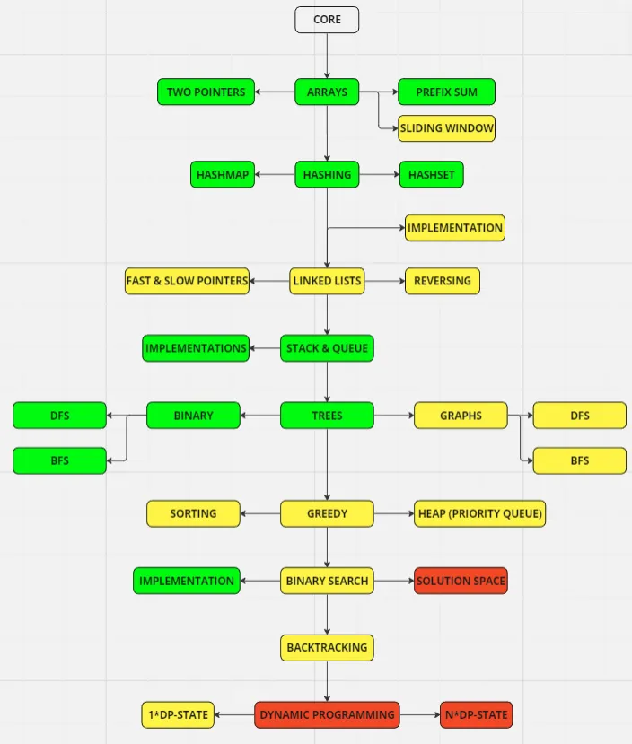

---
layout:
  title:
    visible: true
  description:
    visible: true
  tableOfContents:
    visible: true
  outline:
    visible: true
  pagination:
    visible: false
---

# Summary

### Basics of Programming

* C++ basics
* Arrays
* Matrix
* Strings

### Basic Data Structures

* Stacks
* Queues
* Linked List

### Advanced Data Structures

* Generic Tree / Tries
* Binary Tree
* Binary Search Tree
* Hashmap and Heap

### Algorithms

* Recursion
* Backtracking
* DP
* Greedy
* Graphs


Duplicate this page for every day you want to track.


<table data-full-width="false"><thead><tr><th width="261">Problem</th><th width="169">Pattern/Approach</th><th width="40">Topic</th><th align="center">Time Complexity</th></tr></thead><tbody><tr><td><a data-mention href="print-all-subarrays.md">print-all-subarrays.md</a></td><td>Recursion</td><td></td><td align="center">O(n^2)</td></tr><tr><td></td><td></td><td></td><td align="center"></td></tr></tbody></table>

***

## Tips

Tips

👉🏻 If we are dealing with top/maximum/minimum/closest ‘K' elements among 'N' elements, we will be using a Heap.

👉🏻 If the given input is a sorted array or a list, we will either be using Binary Search or the Two Pointers.

👉🏻 If we need to try all combinations (or permutations) of the input, we can either use Backtracking or Breadth First Search.

👉🏻 Most of the questions related to Trees or Graphs can be solved either through Breadth First Search or Depth First Search.

👉🏻 Every recursive solution can be converted to an iterative solution using a Stack.

👉🏻 For a problem involving arrays, if there exists a solution in O(n^2)time and O(1) space, there must exist two other solutions: 1) Using a HashMap or a Set for O(n) time and O(n) space, 2) Using sorting for O(n log n) time and O(1) space.

👉🏻 If a problem is asking for optimization (e.g., maximization or minimization), we will be using Dynamic Programming.

👉🏻 If we need to find some common substring among a set of strings, we will be using a HashMap or a Trie.

👉🏻 If we need to search/manipulate a bunch of strings, Trie will be the best data structure.

👉🏻 If the problem is related to a LinkedList and we can't use extra space, then use the Fast & Slow Pointer approach.

Tips - 2

Array: Versatile and dynamic list

&#x20;Linked List: Efficient insertions and deletions

&#x20;Hash Table: Quick data retrieval

&#x20;Stack: Last in, first out (LIFO)

&#x20;Queue: First in, first out (FIFO)

&#x20;Heap: Priority data handling&#x20;

Binary Search Tree: Optimal for data search operations

##

<figure><figcaption></figcaption></figure>

## How was the day?

🧠 Mood tracking

Start taking notes…

💡 Observations

Start taking notes…

